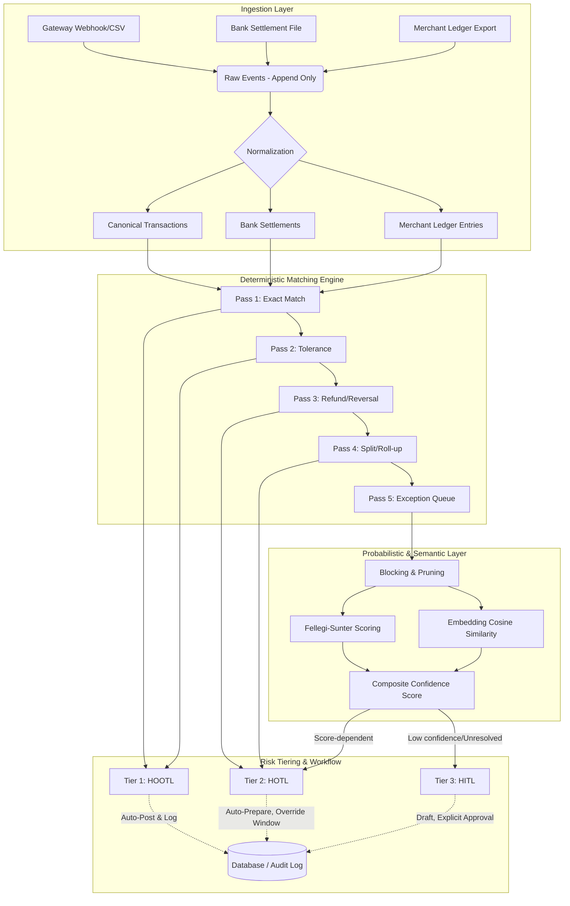

# Razorpay AI Finance Controller — AI-Assisted Payment Reconciliation Engine

## The problem
Payment reconciliation — matching what a gateway processed, what a bank actually settled, and what a merchant's own ledger expects — is still done largely by hand across the industry. This manual matching is the declared bottleneck for finance operations: verification capacity, not generation speed, is what's actually scarce in modern payment flows. The challenge isn't just about matching 1:1 records; it's about untangling timing differences, bank-initiated deductions, refunds, and batched subset sums where many gateway transactions settle as a single bank credit.

## What this does
This is a high-throughput, continuous-close three-way reconciliation engine (gateway ↔ bank settlement ↔ merchant ledger). It leverages a deterministic 5-pass matching core to quickly and safely resolve expected matches, a Fellegi-Sunter + semantic-embedding layer for what deterministic logic can't resolve, and risk-tiered human approval (HOOTL, HOTL, HITL) for anything that mutates financial state.

## The numbers (measured at scale, not a cherry-picked demo)
- **Total processed**: 110,377 records
- **Automated match rate**: 72.29% (79,794 records resolved autonomously)
- **Throughput**: ~1,130 records/sec 
- **Precision/Recall vs. synthetic ground truth**: 92.4% / 67.0%
- **Open exceptions**: 30,583 exactly. Categorized for human review as: 16,573 unresolved | 10,383 timing differences | 3,431 bank-initiated | 196 transaction errors.

*(Note: Pass 5 correctly routes unresolvable records to these exception categories and stages them for semantic AI/human review. To see exactly what the AI generates for human reviewers on these exceptions, see [docs/10_AI_EXPLANATION_SAMPLES.md](docs/10_AI_EXPLANATION_SAMPLES.md). Additionally, the $O(N^2)$ hash-bucket optimization driving our sub-second throughput was applied to Pass 2, taking it from 25+ seconds down to milliseconds).*

## Architecture
See detailed spec: [docs/02_ARCHITECTURE.md](docs/02_ARCHITECTURE.md)



## Why AI is used exactly where it is (and not elsewhere)
In a SOX/audit-compliant financial system, a control must be reproducible and mathematically bounded. We strictly prohibit the LLM from performing financial arithmetic or mutating ledger state. Instead, AI is deployed exclusively for semantic capabilities deterministic logic lacks: parsing unstructured text (OCR'd descriptions, remittance strings), analyzing typos and semantic drift via cosine similarity embeddings, and drafting human-readable explanations. 

## Run it yourself
The engine comes with a reproducible, synthetic data generator that injects realistic anomalies (timing shifts, batched roll-ups, corruptions, refunds, and LLM prompt injections). 

To run the scaling pipeline at 36,000+ transaction bundles (110,000+ total records) and verify the numbers above:
```bash
# Setup your environment (Windows/Linux compatible)
python -m venv venv
venv\Scripts\activate
pip install -r requirements.txt

# Run the definitive scale test script (generates data + executes engine + prints metrics)
python scripts/run_scale_test.py
```

## What's deliberately out of scope
Confident scoping is critical for maturity. The following were actively deemed out-of-scope for the Buildathon:
- **Real bank/gateway API integrations**: We strictly use synthetic data (clearly labeled) to simulate scale and edge cases.
- **Multi-currency/FX conversion logic**: We assume INR-only for v1, though the architecture is ready for extension.
- **Full regulatory reporting/statutory filing generation**: Out of scope for this pipeline boundary.
- **Production-grade auth/SSO**: A minimal scheme handles security in our implementation pattern.
